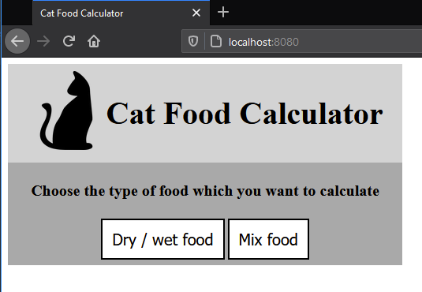
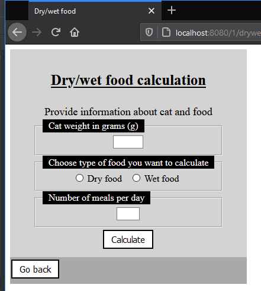
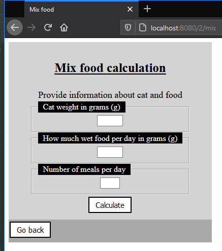
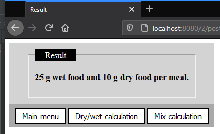

Project upgraded to Spring5 from Java+Swing version (https://github.com/lucasjaruga/cat-food-calculator-app.)

Basic calculator app to calculate how much cat food should cat get per meal.
Algorithm values are based on information from Purizon and Gussto labels.

